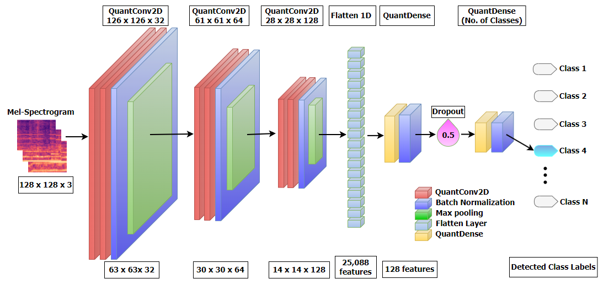
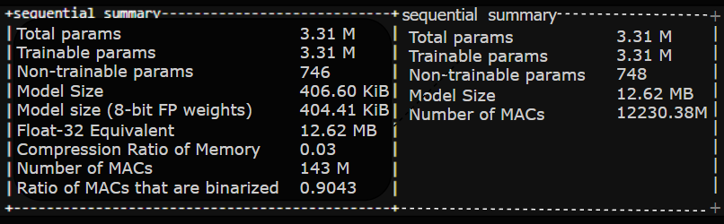

<h1 align="center">Memory Efficient Audio Classification Using Binarized Neural Network</h1>

<p align="center">
  <a href="https://ieeexplore.ieee.org/document/11173395"></a>
  <a href="#"></a>
  <a href="#"></a>
</p>

---
## 📖 Abstract
Deep learning models have revolutionized various fields, but their high computational requirements and large parameter sizes present difficulties for real-time usage and environments with limited resources. In this study, the impact of **binarization** is explored as an effective optimization technique to reduce model complexity while maintaining competitive performance. A deep learning model is trained on two datasets, followed by the application of binarization to create a lightweight version with significantly fewer parameters and lower computational overhead. The results demonstrate that binarization accelerates inference speed, reduces storage demands, and enhances overall efficiency, making deep learning models more suitable for edge computing and low-power devices. Additionally, this work analyzes the trade-offs associated with binarization, such as its effect on accuracy and generalization. The findings highlight the potential of binarization in optimizing deep learning models without requiring specialized hardware, offering a promising direction for efficient AI deployment in real-world scenarios.

---

## 🚀 System Overview





---

## ✨ Key Features
* **Memory-Efficient Architecture:** Utilizes binarized neural networks (BNNs) to significantly reduce model size and computational load.
* **Edge-Ready Deployment:** Optimized for real-time and low-power devices without sacrificing much accuracy.
* **Quantization Technique:** Applies binarization for faster inference and lower storage requirements.
* **Trade-off Analysis:** Explores accuracy vs. efficiency trade-offs for practical deployment in constrained environments.
* **Mel-Spectrogram Processing:** Works effectively with audio data represented as Mel-spectrograms using CNN layers.

---

## 📄 Citation
If you find our work useful for your research, please consider citing our paper.

**Paper Link:** [**Click Here**](https://ieeexplore.ieee.org/document/11173395)

### BibTeX
```bibtex
@INPROCEEDINGS{11173395,
  author={Chakrabarty, Sudip and Bandyopadhyay, Mainak and Bishwas, Pappu},
  booktitle={2025 IEEE Guwahati Subsection Conference (GCON)}, 
  title={Memory Efficient Audio Classification Using Binarized Neural Network}, 
  year={2025},
  volume={},
  number={},
  pages={1-6},
  keywords={Deep learning;Accuracy;Quantization (signal);Computational modeling;Neural networks;Memory management;Robustness;Complexity theory;Convolutional neural networks;Artificial intelligence;Binarized Neural Network (BNN);Quantization Techniques;Memory-Efficient AI;Mel-Spectrogram;Convolutional Neural Network (CNN)},
  doi={10.1109/GCON65540.2025.11173395}}
